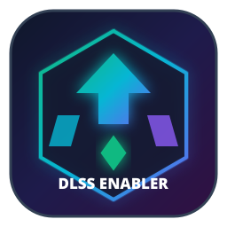

# 🚀 DLSS Enabler for Linux (GUI)

<p align="center">
  
</p>

<p align="center">
  <b>Universal DLSS & Frame Generation Manager for All Linux Distributions</b><br>
  <i>Automatic Game Scanner, Sleek Poster Grid Interface, One-Click Proton Injector</i>
</p>

<p align="center">
  
  
  
  
  
</p>

---

## 📖 Overview

**DLSS Enabler for Linux** is a modern, native desktop application designed for Linux gamers. It allows you to automatically scan your game library and inject the latest **DLSS Enabler** and **OptiScaler** binaries into Proton/Wine game directories with a single click—enabling DLSS Super Resolution and Frame Generation on any compatible GPU (NVIDIA RTX/GTX, AMD Radeon, Intel Arc).

### ✨ Key Features
- 🔍 **Automatic Game Scanner:** Instantly detects installed games across **Steam** (Native, Flatpak, Snap, Library Folders), **Heroic Games Launcher** (Epic, GOG, Amazon), **Lutris**, **Bottles**, and Custom folders (filtering out non-game tools and runtimes automatically).
- 🖼️ **Gorgeous Poster Grid UI:** Displays games in a clean, minimal obsidian dark theme featuring high-resolution vertical cover art posters and live patch-status badges.
- ⚡ **One-Click Core Updates:** Automatically fetches and caches the latest official DLSS Enabler & OptiScaler releases straight from GitHub.
- 🛡️ **Safe Backup & Restore (Unpatch):** Automatically creates `.dlss_backup` files before patching. Fully restores original files on uninstallation.
- 🎛️ **Flexible Hook Methods:** Supports `version.dll`, `dxgi.dll`, `winmm.dll`, `d3d12.dll`, `dinput8.dll` with intelligent recommendations per game.
- 🌐 **Multi-Language Support:** Instant dynamic switching between **English**, **Turkish**, **German**, **French**, **Spanish**, and **Russian** (defaults to English).
- 📋 **Launch Options Generator:** Generates launcher-specific instructions and the required Proton override command (`WINEDLLOVERRIDES="version=n,b" SteamDeck=0 %command%`) with a one-click copy button.
- 🐧 **Cross-Distro Ready:** Fully compatible with Arch Linux, CachyOS, Fedora, Ubuntu, Debian, Pop!_OS, SteamOS, Bazzite, and Manjaro.

---

## 📦 Installation

### Prerequisites
- **Python 3.9+**
- **PyQt6** and **requests**
- **Wine** (for silent setup extraction)

#### Package Installation by Distro:
- **Arch Linux / CachyOS / Manjaro:**
  ```bash
  sudo pacman -S python python-pyqt6 python-requests wine
  ```
- **Ubuntu / Debian / Linux Mint / Pop!_OS:**
  ```bash
  sudo apt install python3 python3-pyqt6 python3-requests wine
  ```
- **Fedora / Nobara / RHEL:**
  ```bash
  sudo dnf install python3 python3-qt6 python3-requests wine
  ```

---

### 🚀 Quick Install

Clone the repository and run the automated installer:

```bash
git clone https://github.com/YYOzcan/dlss-enabler-linux.git
cd dlss-enabler-linux
./install.sh
```

Once installed, **DLSS Enabler** will appear in your desktop application menu, or you can launch it via terminal:
```bash
dlss-enabler-gui
```

---

## 🎮 How to Use

1. Launch the application. Your installed games will be scanned automatically.
2. Check the top bar to ensure the core binaries are ready (click **Check Updates** if needed).
3. Click on any game poster card to open the configuration modal.
4. Select your preferred hook method and click **"⚡ Install DLSS Enabler"**.
5. Click **"📋 Copy"** to copy the Proton launch options:
   ```text
   WINEDLLOVERRIDES="version=n,b" SteamDeck=0 %command%
   ```
6. Paste this into your game launcher properties (e.g., Steam: Right-click game > Properties > General > Launch Options).
7. Launch your game and enable DLSS / Frame Generation in graphics settings!

---

## 📁 Project Structure

```text
dlss-enabler-linux/
├── assets/                  # SVG & PNG app icons
├── bin/
│   └── dlss-enabler-gui     # Launcher script
├── src/
│   └── dlss_enabler/
│       ├── downloader.py    # GitHub release downloader & extractor
│       ├── i18n.py          # Multi-language translation engine (EN, TR, DE, FR, ES, RU)
│       ├── patcher.py       # Safe DLL injector & backup manager
│       ├── quirks.py        # Game compatibility & recommendations DB
│       ├── scanner.py       # Steam, Heroic, Lutris, Bottles scanner engine
│       ├── gui/
│       │   ├── game_card.py   # Poster card grid & detail modal UI
│       │   ├── main_window.py # Main window layout & controllers
│       │   └── styles.py      # Obsidian minimalist dark theme QSS
│       └── main.py          # Application entry point
├── tests/                   # Automated unit & integration test suites
├── install.sh               # Cross-distro installer script
├── uninstall.sh             # Clean uninstaller script
├── dlss-enabler.desktop     # XDG desktop integration file
├── pyproject.toml           # Standard Python project metadata
└── requirements.txt         # Python dependencies
```

---

## 🤝 Contributing
Bug reports, game compatibility tweaks, and pull requests are always welcome!

## 📜 License
This project is licensed under the MIT License. DLSS Enabler and OptiScaler binaries belong to their respective creators.
